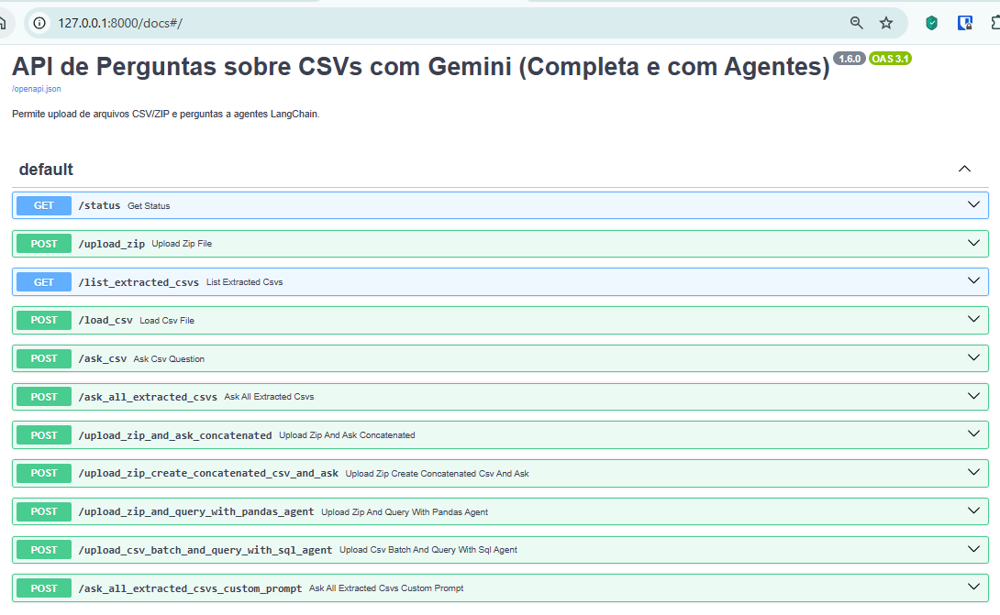
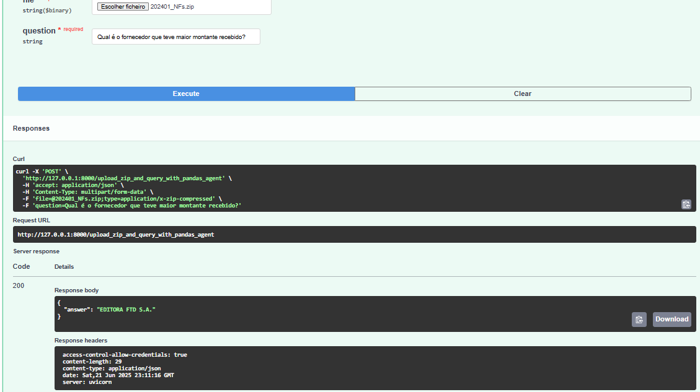
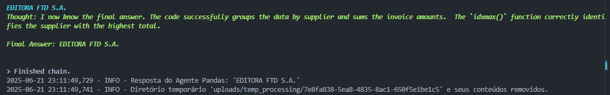

# poc-fastapi-llm-vr-back

POC Backend API Fastapi -Automação de Vale Tramsporte

Frontend: https://github.com/lyndontavares/poc-fastapi-llm-vr-front

## Instale

```
pip install -r requirements.txt
```

## Execute

```
uvicorn main:app --reload --port 8000
fastapi run main.py --port 8000
```

## Swagger

```
http://127.0.0.1:8000/docs
```

<div align="center">

 

</div>

## Teste - Swagger [upload_zip_and_query_with_pandas_agent]

Recebe um arquivo ZIP, extrai e concatena todos os CSVs em um DataFrame, e usa o agente LangChain (create_pandas_dataframe_agent) para responder perguntas complexas que exigem manipulação de dados Pandas.

<div align="center">

 

</div>

## Teste - LOGS
<div align="center">

 

</div>

## Objetivo da Atividade:
