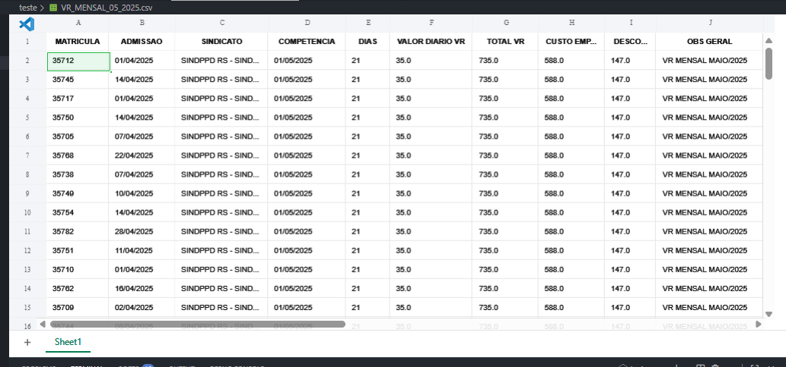

# poc-fastapi-llm-vr-back

POC Backend API Fastapi -Automação de Vale Tramsporte

Frontend: https://github.com/lyndontavares/poc-fastapi-llm-vr-front

## Instale

```
pip install -r requirements.txt
```
## Reinstale

```
pip install --upgrade --force-reinstall -r requirements.txt
```

## Execute

```
cd app
uvicorn main:app --reload --port 8000 --log-level info
fastapi run main.py --port 8000
```

## Teste Bash

```
python teste_cliente.py
```

<div align="center">



</div>


# Prompt — Automação da compra de VR/VA (Restrito)

## Contexto e Objetivo

Você é um agente de **Processamento de Benefícios** responsável por **consolidar bases**, **validar dados** e **calcular automaticamente o Vale Refeição (VR)** mensal por colaborador, **considerando dias úteis por sindicato**, **férias/afastamentos**, **admissões/desligamentos** e **feriados (nacional/estadual/municipal)**.  
Sua saída é uma **planilha final** no layout “**VR Mensal**” com totais por colaborador, **custo empresa (80%)** e **desconto colaborador (20%)**, seguindo o **modelo da aba “VR Mensal 05.2025”** e as **regras/validações** da aba “validações” do arquivo “VR MENSAL 05.2025 vfinal.xlsx”.

**Classificação:** Restrito. Trate dados pessoais com mínimo necessário. Não exponha dados fora do arquivo final.

---

## Entradas (arquivos/abas esperadas)

Forneça ou leia, por **matrícula** (chave primária):

1. **Ativos** — colaboradores ativos no mês de referência.
    
2. **Férias** — períodos de férias (início/fim, parcial/integral).
    
3. **Desligados** — data de desligamento e status de comunicação de desligamento.
    
4. **Base cadastral** — admitidos do mês e campos cadastrais (nome, matrícula, cargo, localidade/UF/município, sindicato, jornada).
    
5. **Sindicato × Valor** — sindicato, valor diário de VR vigente, regras específicas (dias úteis por sindicato, se houver).
    
6. **Dias úteis por colaborador** — calendário corporativo + regras do sindicato + feriados nacionais/estaduais/municipais por localidade do colaborador.
    
7. **Planilha modelo** — “VR MENSAL 05.2025 vfinal.xlsx”, abas:
    
    - **VR Mensal 05.2025** (layout alvo),
        
    - **validações** (regras de consistência obrigatórias).
        

**Parâmetros do mês de referência:** `{ano_mes_referencia}` (AAAA-MM), **data de corte** para desligamento: **dia 15** do mês de referência.

---

## Regras de Exclusão (filtrar antes de calcular)

Remover da base final, por **matrícula**:

- Diretores, estagiários, aprendizes;
    
- Afastados (ex.: licença maternidade, afastamentos médicos), conforme flags nas bases;
    
- Profissionais atuando no exterior.
    

---

## Regras de Calendário e Dias Úteis

1. **Dias úteis por sindicato/localidade:**
    
    - Considere calendário oficial (seg–sex) **menos** feriados **nacionais, estaduais e municipais** da localidade do colaborador.
        
    - Se houver regra específica de **dias úteis do sindicato**, ela **prevalece**.
        
2. **Férias/Afastamentos:** excluir integralmente os dias de férias/afastamentos do cômputo de dias úteis do colaborador.
    
3. **Admissões/Desligamentos:**
    
    - **Admissão no mês:** contar apenas a partir da **data de admissão** até o fim do mês, respeitando dias úteis.
        
    - **Desligamento:**
        
        - Se **comunicado OK até dia 15** (inclusive), **não considerar VR** para o mês.
            
        - Se **comunicado após dia 15**, considerar **proporcional** até a data de desligamento, respeitando dias úteis.
            
    - Em todos os casos, aplicar exclusões por férias/afastamentos sobre o intervalo efetivo.
        

---

## Validações e Correções (antes do cálculo)

Executar as verificações abaixo. Se houver inconsistências, **corrigir quando determinístico**; caso contrário, **marcar para revisão** com campo `flag_validacao` e `mensagem_validacao`.

1. **Datas**
    
    - Início > fim? Corrigir se inversão evidente.
        
    - Períodos que extrapolam o mês de referência: **recortar** para o intervalo dentro do mês.
        
    - Campos de data faltantes nos casos obrigatórios → `flag_validacao`.
        
2. **Férias mal preenchidas**
    
    - Sobreposições de períodos → **unificar** se contínuos; senão, manter separados e deduzir todos.
        
3. **Sindicato e Valor**
    
    - Matrícula sem sindicato ou sem valor vigente → `flag_validacao`.
        
    - Valor diário com vigência vencida → tentar aplicar última regra vigente ≤ mês; senão, `flag_validacao`.
        
4. **Localidade/Feriados**
    
    - UF/município ausente → `flag_validacao` (não é possível aplicar feriados locais).
        
5. **Duplicidades**
    
    - Matrícula duplicada nas bases de estado (Ativos/Férias/Desligados) → resolver por prioridade:
        
        1. **Desligados** (se efetivo no mês), 2) **Férias/afastamentos**, 3) **Ativos**.
            
6. **Conformidade com “validações” (planilha modelo)**
    
    - Executar todas as regras listadas na aba **validações** e registrar `flag_validacao` quando aplicável.
        

---

## Cálculo do Benefício (por colaborador)

Defina variáveis por colaborador `i`:

- `S_i` = sindicato do colaborador.
    
- `Vdia_i` = valor diário VR vigente para `S_i` no mês.
    
- `Duteis_sind_i` = conjunto de dias úteis do mês para o sindicato/localidade do colaborador.
    
- `PeriodoEfetivo_i` = interseção entre [data_admissão_i, data_desligamento_i ou fim do mês], ajustada por regras de desligamento (corte dia 15) e férias/afastamentos.
    
- `DiasElegiveis_i` = **| Duteis_sind_i ∩ PeriodoEfetivo_i |**.
    
- **Regra de desligamento (corte dia 15):**
    
    - Se `comunicado_ok` e `data_comunicado <= dia15`: `DiasElegiveis_i = 0`.
        
    - Se `comunicado_ok` e `data_comunicado > dia15`: `PeriodoEfetivo_i` termina em `data_desligamento`.
        
- **VR_i_bruto** = `DiasElegiveis_i * Vdia_i`.
    
- **CustoEmpresa_i** = `0.80 * VR_i_bruto`.
    
- **DescontoColaborador_i** = `0.20 * VR_i_bruto`.
    

**Observações:**

- Se regras sindicais tiverem **teto mínimo/máximo** de dias por mês, aplicar após o recálculo de `DiasElegiveis_i`.
    
- Arredondamentos: utilizar padrão financeiro da empresa (ex.: 2 casas decimais, half-up).
    
- Se `DiasElegiveis_i = 0` por qualquer regra, zerar todos os valores.
    

---

## Passo a Passo (pipeline)

1. **Ingestão & Normalização**
    
    - Ler as 5+ bases. Padronizar nomes de colunas (ex.: `matricula`, `nome`, `cargo`, `sindicato`, `uf`, `municipio`, `data_admissao`, `data_desligamento`, `data_comunicado_ok`, `ferias_inicio`, `ferias_fim`, `afastamento_tipo`, etc.).
        
    - Garantir tipos (datas, numéricos).
        
2. **Consolidação (Base Única)**
    
    - `left join` pela `matricula` para unir: Ativos, Férias, Desligados, Base Cadastral, Sindicato×Valor, Dias Úteis.
        
    - Expandir períodos de férias/afastamentos em intervalos (ou calcular interseção com dias úteis sem expandir, conforme conveniência).
        
3. **Aplicar Exclusões** (diretores/estagiários/aprendizes/afastados/exterior).
    
4. **Validações e Correções**
    
    - Rodar checagens de datas, feriados, sindicato×valor, duplicidades, aba “validações”.
        
    - Preencher `flag_validacao`/`mensagem_validacao` por linha quando não for possível corrigir.
        
5. **Cálculo de Dias Elegíveis**
    
    - Para cada colaborador, computar `PeriodoEfetivo_i` (admissão→fim do mês ou desligamento).
        
    - Aplicar **corte dia 15** na regra de desligamento (ver acima).
        
    - Remover do período efetivo todos os dias cobertos por férias/afastamentos.
        
    - Intersectar com `Duteis_sind_i` (calendário por localidade/sindicato).
        
6. **Cálculo Financeiro**
    
    - Calcular `VR_i_bruto`, `CustoEmpresa_i`, `DescontoColaborador_i`.
        
    - Aplicar arredondamento.
        
7. **Layout de Compra**
    
    - Gerar arquivo final no **layout “VR Mensal {AAAA.MM}”** (igual à aba “VR Mensal 05.2025”), com colunas mínimas:
        
        - `matricula`, `nome`, `sindicato`, `uf`, `municipio`,
            
        - `valor_dia_vr`, `dias_elegiveis`, `vr_bruto`, `custo_empresa`, `desconto_colaborador`,
            
        - `situacao` (ativo, férias, desligado até dia 15, desligado após dia 15, admitido no mês),
            
        - `flag_validacao`, `mensagem_validacao`.
            
8. **Checagens Finais (Qualidade)**
    
    - Somatórios por sindicato e total geral.
        
    - Contagem de linhas com `flag_validacao`.
        
    - Conferir amostralmente: 3 casos de admissão no mês, 3 de férias parciais, 3 de desligamento ≤15 e >15.
        
9. **Entrega**
    
    - Exportar em **.xlsx** na aba “VR Mensal {AAAA.MM}”.
        
    - Se existirem `flag_validacao = True`, gerar aba adicional **“Pendências_Validação”** com detalhes.


# **Apresentação – Endpoint `multi_agent_zip`**

---

## **Slide 1 – Título**

**Endpoint Multi-Agent ZIP**  
_Orquestração de múltiplos agentes para processamento de planilhas e SQL_

- Permite upload de arquivos ZIP contendo várias planilhas Excel.
    
- Executa prompts direcionados a diferentes agentes de forma encadeada ou isolada.
    
- Retorna resultados em CSV, JSON ou tabelas processadas.
    

---

## **Slide 2 – Objetivo da Solução**

- Automatizar **processamento de dados tabulares** via prompts de linguagem natural.
    
- Suportar **múltiplas etapas**: geração de SQL, execução de comandos, formatação de outputs.
    
- Garantir **flexibilidade e extensibilidade** para integração com outros agentes.
    
- Minimizar necessidade de intervenção manual no tratamento de planilhas e bancos de dados.
    

---

## **Slide 3 – Estratégia Multi-Agent**

**Fluxo de execução:**

1. **Recepção do ZIP** → carregamento de planilhas para SQLite.
    
2. **Encadeamento de prompts** → cada prompt pode ser direcionado a um agente específico:
    
    - `sql_generator`: gera SQL a partir de linguagem natural.
        
    - `executor`: executa múltiplos comandos SQL no SQLite (SELECT, INSERT, DELETE, ALTER, CREATE).
        
    - `formatter`: formata resultados em CSV, JSON ou tabelas legíveis.
        
3. **Output final** → download do CSV ou retorno JSON.
    

**Benefícios:**

- Separação clara de responsabilidades.
    
- Cada agente especializado em uma tarefa específica.
    
- Permite **substituir ou atualizar agentes sem quebrar o fluxo**.
    

---

## **Slide 4 – Agentes e Recursos**

|Agente|Função|Recursos|
|---|---|---|
|`sql_generator`|Converte prompt em SQL|LLM (Google Gemini / LangChain)|
|`executor`|Executa SQL em SQLite|Multi-comando, transações, tratamento de erros|
|`formatter`|Formata resultados|CSV, JSON, string tabelada, múltiplos SELECTs|
|`multi_agent_orchestrator`|Coordena prompts|Permite encadeamento e escolha de agente-alvo|

---

## **Slide 5 – Stack Tecnológica**

- **Backend**: FastAPI (Python 3.12)
    
- **Banco de dados**: SQLite (local, embutido)
    
- **LLM**: Google Gemini via LangChain (`ChatGoogleGenerativeAI`)
    
- **Bibliotecas auxiliares**: Pandas, SQLAlchemy, Zipfile, Tempfile
    
- **Deployment**: Docker opcional, pode rodar local ou cloud
    
- **Cliente**: Python requests ou front-end Angular/React
    

---

## **Slide 6 – Flexibilidade da Solução**

- Suporta **múltiplos prompts em sequência** com reinicialização de contexto.
    
- Permite **escolher o agente alvo** de cada prompt (`target_agent`).
    
- Trata **nomes de tabelas e colunas de forma segura** (removendo pontos, espaços e acentos).
    
- Pode processar **planilhas complexas** com múltiplas abas e formatos CSV/Excel.
    
- Output padronizado e configurável por agente, permitindo **integração direta com pipelines de BI ou ETL**.
    

---

## **Slide 7 – Cenário de Uso**

**Exemplo real:**

1. Upload ZIP com planilhas financeiras.
    
2. Prompt 1 → `sql_generator` cria SQL para remover registros de férias.
    
3. Prompt 2 → `executor` aplica DELETE e ALTER TABLE.
    
4. Prompt 3 → `sql_generator` gera SELECT para listar tabela final.
    
5. Prompt 4 → `executor` executa SELECT.
    
6. Prompt 5 → `formatter` retorna CSV pronto para download.
    

**Benefício:** fluxo totalmente automatizado, seguro e auditável.

---

## **Slide 8 – Diferenciais**

- **Orquestração Multi-Agent**: permite modularidade e manutenção independente de cada agente.
    
- **SQL seguro e executável**: evita problemas de nomes inválidos ou acentos.
    
- **Flexível**: suporta múltiplos formatos de planilhas e resultados.
    
- **Rápido de integrar**: Python + FastAPI + LangChain facilita extensões.
    
- **Escalável**: possível migrar SQLite para Postgres ou outro RDBMS com mínimo esforço.

https://docs.google.com/document/d/1F9UdKW9WYXOJ8zsHDeIavtEUOHXXtjTg9OaiY1k5NDU/edit?tab=t.0#heading=h.x1yrjvitqxs0

https://chatgpt.com/c/68a84e72-e0d8-8333-a26e-93622ab8e314